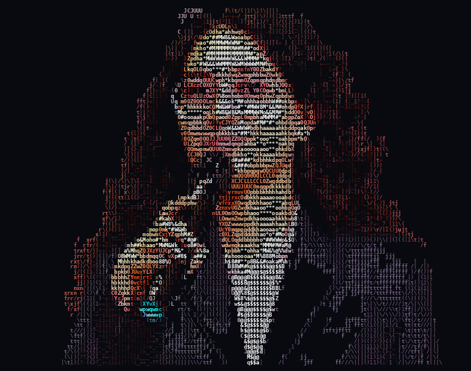

<div align="center">


&nbsp;

&nbsp;


</div>

<br>

<table align="center">
<tr>
<td width="38%" valign="middle" align="center">



</td>
<td width="62%" valign="middle">

```yaml
tanisha@devbox ~ % whoami

name:        Tanisha Dhakad
role:        Full Stack Developer
currently:   Building @ Maxcode IT Solutions
stack:       MERN · Next.js · TypeScript · AI/ML
based_in:    Indore, India

achievements:
  - 🥇 SIH 2025 — National Winner (ISRO PS)
  - 🏆 Top 90 / 5000+ — IIT BHU Web Dev Battle
  - 🎯 8x Hackathon Participant

philosophy: >
  I don't build todo apps.
  I build systems that ship.

status:      open_to_freelance ✅
contact:     tanishadhakad17@gmail.com
```


<br>

[](https://linkedin.com/in/tanishadhakad)
[](https://instagram.com/thecurlyycoder)
[](https://tanishaportfolio-ten.vercel.app/)
[](mailto:tanishadhakad17@gmail.com)

</td>
</tr>
</table>

<br>

## 🛠️ Tech Stack

<div align="center">


</div>

<br>

## 🚀 What I Actually Build

> Not todo apps. Not weather widgets. Real products with real auth, real roles, real data.

<table>
<tr>
<td width="50%" valign="top">

### 🛰️ Maitri AI
**AI Assistant for Astronaut Well-Being**
*SIH 2025 — National Winner (ISRO)*

Offline multimodal AI system monitoring astronauts' psychological & physiological health via voice tone analysis and facial expression detection. Zero internet dependency — built for space missions.

`Python` `Multimodal AI` `Offline ML` `Emotion Detection`

</td>
<td width="50%" valign="top">

### 🏠 Real Estate SaaS Platform
**Production-grade. Not a demo.**

Full property management platform — CRM workflows, lead tracking, booking systems, subscription billing. Role-based access across 5 user types with live analytics dashboards.

`Next.js 15` `React 19` `TypeScript` `TensorFlow.js` `Firebase` `JWT`

</td>
</tr>
<tr>
<td width="50%" valign="top">

### 🌐 TEDxIPSA Official Website
**Built solo. Live. Serving the Indore TEDx community.**

`MERN Stack`

</td>
<td width="50%" valign="top">

### 💼 More on GitHub
Check out my pinned repos for AI integrations, hackathon builds, and full-stack experiments I'm shipping right now.

`+ 8 Hackathon Projects`

</td>
</tr>
</table>

<br>

## 🏆 Achievements

<div align="center">

| | Achievement |
|:---:|---|
| 🥇 | **Smart India Hackathon 2025** — National Winner (ISRO problem statement) |
| 🏆 | **Top 90 / 5000+** — Web Dev Battle by IIT BHU |
| 🥇 | **UDAAN** — B.Tech Major Project Winner (2026) |
| 🥇 | **UDAAN** — B.Tech Minor Project Winner (2025) |
| 🏅 | **Hack the Mountains 5.0** — Marwadi University |
| 🏅 | **MUJHackX** — Manipal University Jaipur |

</div>

<br>

## 📊 GitHub Analytics

<div align="center">


</div>

<br>

## 📍 Currently

- 🔨 Shipping full-stack + AI projects at **Maxcode IT Solutions**
- 📱 Creating dev content at **[@thecurlycoder](https://instagram.com/thecurlyycoder)** on Instagram
- 📖 Going deeper into **AI integrations + Next.js architecture**
- 💼 Open to **freelance projects** — reach out if you have something interesting

<br>

<div align="center">

### 💬 Let's Talk

If you have a project, a role, or just want to talk tech — my inbox is always open.


</div>
