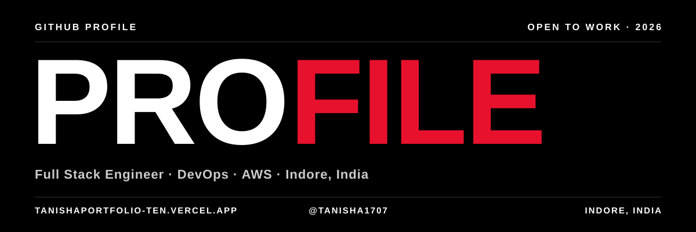
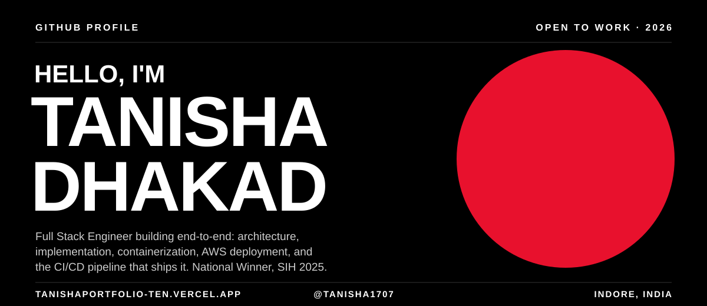
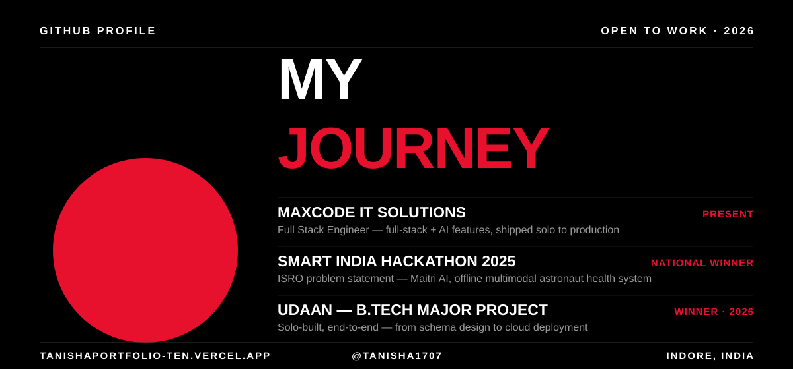
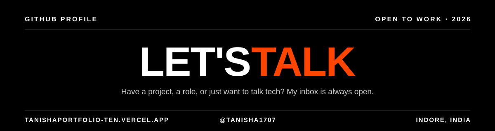

  

&nbsp;

&nbsp;

&nbsp;

  

 

<table>
<tr><td>

|   |   |
|---|---|
| **Role** | Full Stack Engineer (Full Stack + DevOps) |
| **Working at** | Maxcode IT Solutions |
| **Stack** | MERN · Next.js · TypeScript · AWS · Docker · CI/CD |
| **Based in** | Indore, India |
| **Status** | Open to Full Stack + DevOps roles ✅ |

**🎯 End-to-End MVP Delivery**
From idea to production, solo: system design → full-stack build → Dockerized deployment → AWS hosting → CI/CD automation. That's how Maitri AI and the Real Estate SaaS Platform below went from concept to shipped product.

> ⚡ **Philosophy** — *I don't build todo apps. I build systems that ship.*

</td></tr>
</table>

 

## 🛠️ Tech Stack

**Languages**
 

**Frontend**
 

**Backend & Data**
 

**Cloud & DevOps**
 

**AI/ML**
 

 

 

## 🚀 What I Actually Build

*Not todo apps. Not weather widgets. Real products with real auth, real roles, real data.*

 

<table>
<tr>
<td width="50%" valign="top">

### 🛰️ Maitri AI
**AI Assistant for Astronaut Well-Being**
*SIH 2025 — National Winner (ISRO)*

Offline multimodal AI system monitoring astronauts' psychological & physiological health via voice tone analysis and facial expression detection. Zero internet dependency — built for space missions.

   

</td>
<td width="50%" valign="top">

### 🏠 Real Estate SaaS Platform
**Production-grade. Not a demo. Shipped end-to-end.**

Full property management platform — CRM workflows, lead tracking, booking systems, subscription billing. Role-based access across 5 user types with live analytics dashboards. Designed, built, and deployed solo — from schema design to cloud hosting.

     

</td>
</tr>
<tr>
<td width="50%" valign="top">

### 🌐 TEDxIPSA Official Website
**Built solo. Live. Serving the Indore TEDx community.**

</td>
<td width="50%" valign="top">

### 💼 More on GitHub
Check out my pinned repos for AI integrations, hackathon builds, and full-stack experiments I'm shipping right now.

</td>
</tr>
</table>

 

## 📊 GitHub Analytics

  

<picture>
  <source media="(prefers-color-scheme: dark)" srcset="https://raw.githubusercontent.com/tanisha1707/tanisha1707/output/github-contribution-grid-snake-dark.svg">
  <source media="(prefers-color-scheme: light)" srcset="https://raw.githubusercontent.com/tanisha1707/tanisha1707/output/github-contribution-grid-snake.svg">
  
</picture>

 

## 🏆 Achievements

| | Event | Result |
|:---:|---|---|
| 🥇 | Smart India Hackathon 2025 (ISRO problem statement) | **National Winner** |
| 🏆 | Web Dev Battle — IIT BHU | **Top 90 / 5000+** |
| 🥇 | UDAAN — B.Tech Major Project | **Winner (2026)** |
| 🥇 | UDAAN — B.Tech Minor Project | **Winner (2025)** |
| 🏅 | Hack the Mountains 5.0 | Marwadi University |
| 🏅 | MUJHackX | Manipal University Jaipur |

 

## 📍 Currently

- 🔨 Shipping full-stack + AI projects at **Maxcode IT Solutions**
- ☁️ Deepening my **AWS & DevOps** practice — CI/CD, containers, and cloud deployment
- 🎯 Actively looking for **Full Stack + DevOps** roles — open to full-time opportunities
- 📱 Creating dev content at **[@thecurlycoder](https://instagram.com/thecurlyycoder)** on Instagram
- 💼 Also open to **freelance projects** — reach out if you have something interesting

 

